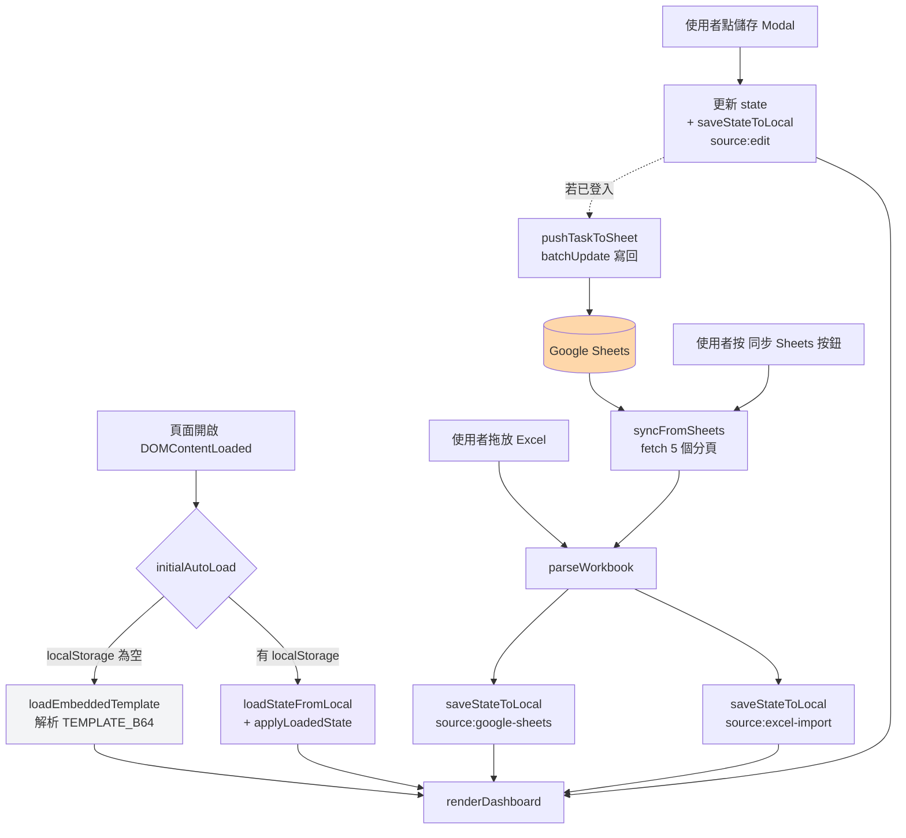

# WBS Dashboard 現行架構文件 (As-Is)

> 撰寫日:2026-05-19
> 對應 commit:`5eec9c2`(撰寫時的 `main` HEAD)
> 對應檔案:`index.html`(5745 行,~357 KB,單檔)

---

## 1. 文件目的

這份文件是 **Phase 1 改造前的現況快照**,用來作為下一步「把 Google Sheets 升級為唯一真實來源」設計討論的共同基礎。

校準後的 Phase 1 目標為:

- 把 **localStorage 從『事實上的真實來源』降級為『讀取快取』**
- 把 **Google Sheets 從『手動雙向同步工具』升級為『唯一真實來源』**
- 加入 **Sheet ID 輸入 UI**,拔掉寫死設定
- 加入從 **Sheets 拉取真實 `modifiedTime`** 的機制
- `TEMPLATE_B64` 維持作為首次載入或斷網時的 fallback

本文件忠實描述「現況」,不混入未來的目標。任何「應該怎麼樣」的判斷集中在第 7、8 章。

---

## 2. 技術堆疊

### 2.1 前端

- **無框架的 Vanilla JavaScript** — 不使用 React / Vue / 任何 SPA 框架。
- **無建置工具** — 沒有 webpack / vite / npm scripts,瀏覽器直接解析 `index.html`。
- **單檔架構** — 所有 HTML / CSS / JS / 嵌入式 Excel 範本都塞在同一個 `index.html`。
- ES2017+ 語法(async/await、optional chaining、spread)。

### 2.2 第三方函式庫(全部走 CDN)

| 函式庫 | 版本 | 來源 | 用途 |
|---|---|---|---|
| **SheetJS (xlsx)** | 0.18.5 | `cdnjs.cloudflare.com` | Excel 解析(`XLSX.read`)+ 匯出(`XLSX.writeFile`) |
| **Google Identity Services** | 最新 | `accounts.google.com/gsi/client` | OAuth2 登入(One-Tap + Sign-In button) |
| **Google Fonts** | — | `fonts.googleapis.com` | Noto Serif TC / Noto Sans TC / Inter / JetBrains Mono |

### 2.3 第三方服務 / API

- **Google Sheets API v4**:用原生 `fetch` 直接打 REST endpoints(`/values/{range}`、`values:batchUpdate`),無 SDK。
- **Gmail API**:同樣 `fetch` 直打,用來寄事件通知(目前**停用**,見 §7)。
- **Google OAuth2**:Client ID 寫死在程式碼,Scopes 為 `spreadsheets`(讀寫)+ `gmail.send`。

### 2.4 部署

- **GitHub Pages**:`paulhsu02060.github.io/wbs-dashboard`
- 推 `main` 分支 → GitHub Pages 自動部署 → 全球 CDN 提供靜態檔。
- 無後端、無資料庫。

---

## 3. 檔案結構

```
wbs-dashboard/
└── index.html       # 整個應用,5745 行
```

整個 repo 只有 1 個原始碼檔案。沒有 README、`package.json`、`.gitignore`、CI 設定。

### `index.html` 內部分區

| 行區間 | 區塊 | 內容 |
|---|---|---|
| 1–10 | `<head>` 前置 | meta、Google Fonts、SheetJS CDN |
| 11–2160 | `<style>` | 全部 CSS:topbar、empty-state、KPI、phase/dept bar、甘特、看板、Modal、collapsible、認證 timeline、material grid 等 |
| 2162 | GIS script tag | Google Identity Services 載入 |
| 2164–2528 | `<body>` HTML | topbar、empty-state、7 大儀表板區、3 個 Modal |
| **2533–2537** | **嵌入式範本** | `const TEMPLATE_B64 = "..."` — base64 編碼的完整 Excel 檔(~11.9 萬字元,占整檔大半體積) |
| 2542–2555 | state 物件 | 全域 `state`(`tasks`、`certs`、`projectInfo` 等) |
| 2557–2560 | 排序常數 | `PHASE_ORDER`、`CAPACITY_ORDER`、`CAP_PHASE_ORDER`、`STATUS_ORDER` |
| 2565–2670 | 共用 helpers | `toast`、`parseDate`、`fmtDate`、`daysBetween`、predecessor 解析、`isTaskBlocked` |
| 2679–2787 | **localStorage 持久化** | `STORAGE_KEY = "wbs_dashboard_state_v10"`、`serializeState`、`loadStateFromLocal`、`applyLoadedState` |
| 2802–2833 | 進度自動計算 | `recomputeTaskProgress`(canonical rule) |
| 2839–2906 | 檔案上傳 | dropzone、`handleFile` |
| 2908–3282 | **Excel 解析** | `parseWorkbook`(WBS、專案資訊、內測時程、樣機需求、物料、生產&庫存、行事曆、商檢時程) |
| 3294–3318 | 主渲染入口 | `renderDashboard` |
| 3325–3648 | Excel 匯出 | `exportToExcel`、`buildGanttSheet` |
| 3650–4267 | 各區 render | KPI、phase、dept、inner test、production、inventory、materials、certs |
| 4269–4356 | 風險清單 | `renderRisks` |
| 4359–4991 | 甘特圖 | `renderGantt`、scroll 同步、scale 切換 |
| 4393–4672 | 任務編輯 Modal | `openTaskEdit`、`saveTaskEdit`、依賴面板 |
| 4997–5222 | 任務清單 + 看板 | filter、search、kanban |
| 5225–5680 | **Google Sheets / Gmail** | `SHEET_ID` 寫死、OAuth、`syncFromSheets`、`pushTaskToSheet`、`notifyEvent` |
| 5683–5741 | 初始載入 | `loadEmbeddedTemplate`、`initialAutoLoad`(三層優先序) |

---

## 4. 資料流(關鍵章節)

### 4.1 資料從哪裡來

頁面開啟時,`initialAutoLoad()`(`index.html:5715`)依照下列**三層優先序**決定資料來源:

1. **第一順位:`localStorage`** — key 為 `wbs_dashboard_state_v10`。
   只要有任何先前儲存過的狀態(來自 Excel 匯入、手動編輯、或 Sheets 同步),就直接還原並渲染,**不再向其他來源查詢**。
2. **第二順位:嵌入式 `TEMPLATE_B64`** — 當 localStorage 為空時,解析嵌在 HTML 內的 base64 Excel 檔當作預設資料。
3. **完全沒有自動拉 Google Sheets**。Sheets 只在使用者**手動按「同步 Sheets」按鈕**(topbar)後才會被讀取。

此外有兩個額外的入口:

- **拖放 / 上傳 Excel**:`handleFile` → `parseWorkbook` → 覆寫 state + 存入 localStorage(`source: "excel-import"`)。
- **Modal 編輯**:`saveTaskEdit` 等 → 改 state + 存入 localStorage(`source: "edit"`)+ **如果已登入**,fire-and-forget push 一筆回 Sheets(`pushTaskToSheet`)。

### 4.2 資料如何儲存

| 儲存位置 | Key / 形式 | 內容 | 持久性 |
|---|---|---|---|
| **`localStorage`** | `wbs_dashboard_state_v10` | 完整序列化 state(tasks、certs、materials、raw sheets...) | 跨頁面 reload 永久,清快取會掉 |
| **`localStorage`** | `wbs_dashboard_state_v10_meta` | `{ savedAt, source }` 寫入 metadata | 同上 |
| **`sessionStorage`** | `wbs_access_token` | Google OAuth access token | 關閉分頁即失效 |
| **`sessionStorage`** | `wbs_user` | 使用者 profile(name/email/picture) | 同上 |
| **記憶體** | `state` 物件 | 所有運行中資料 | reload 即遺失,但會先寫進 localStorage |
| **Google Sheets** | `1XHC4Eq2aRNDZ5YWakeairv7s__xx6rbB6_R4Ux8gMrU` | 與本機 state 同形狀的試算表 | 永久,但**只有手動同步時才參與資料流** |

Date 物件序列化時用 `{ __date: ISO }` 包裝,反序列化時用 reviver 還原,以保留 `Date` 型別。

### 4.3 資料如何渲染到 UI

`renderDashboard()`(`index.html:3294`)是唯一的主渲染入口,呼叫一連串 `renderXxx()` 函式,各自把 state 的子集合轉成 HTML,塞入對應 `<div>` 容器:

```
renderDashboard()
├── renderProjectHeader()   → #ph-title / #ph-meta
├── renderKPI()             → #kpi-grid(TASKS / DONE / IN-PROGRESS / DELAYED / OVERALL / DAYS LEFT)
├── renderPhase()           → #phase-list(階段進度條)
├── renderDept()            → #dept-list(部門負荷堆疊條)
├── renderInnerTestTable()  → #cap-matrix-wrap
├── renderProduction()      → #production-wrap
├── renderInventory()       → #inventory-wrap
├── renderCerts()           → #certs-wrap(認證 timeline)
├── renderRisks()           → #risk-area
├── renderGantt()           → #gantt(甘特圖,支援日/月/年)
├── populateFilters()       → 任務清單下拉選單
├── renderTaskList()        → #task-grouped(表格分組)
└── renderKanban()           → #kanban(看板五欄)
```

### 4.4 使用者操作後資料如何更新

- 點任務卡片 / 表格列 / 甘特列 → `openTaskEdit(wbs)` 開 Modal,把該任務的欄位填進表單。
- 在 Modal 改任何欄位 → 按「儲存」→ `saveTaskEdit()`:
  1. 把表單值寫回 state 的對應 task 物件
  2. 呼叫 `recomputeTaskProgress(t)` 重算進度(用實際開始日/完成日/今日推算,**進度欄位不可手動覆寫**)
  3. `saveStateToLocal("edit")` — 立刻寫 localStorage
  4. `renderDashboard()` — 整個儀表板重繪
  5. 若 `gAccessToken` 存在 → `pushTaskToSheet(t)` fire-and-forget push 回 Sheets
  6. 若狀態 / 風險 / 實際完成日有變化 → 透過 `notifyEvent` 派發 Gmail 通知(目前已停用)

### 4.5 重新整理頁面後資料會不會消失

**不會,但有條件**:

- 只要 localStorage 沒被清,**任何來源的最新狀態**(Excel 匯入、手動編輯、Sheets 同步結果)都會在 reload 後立即還原。
- 如果使用者清瀏覽器資料、用無痕模式、換瀏覽器 → 回到 `TEMPLATE_B64` 內嵌範本當預設(可能比 Sheets 落後好幾天)。
- **不會自動從 Sheets 補資料**;使用者必須手動登入並按「同步 Sheets」。

### 4.6 資料流圖



注意:**Google Sheets 沒有出現在自動載入路徑**,只接收主動 push 與被動 pull。

---

## 5. 主要功能模組

| 模組 | 對應檔案區段 | 關鍵函式 |
|---|---|---|
| 1. 初始載入(三層優先序) | `index.html:5683–5741` | `initialAutoLoad`、`loadStateFromLocal`、`loadEmbeddedTemplate` |
| 2. Excel 匯入 | `index.html:2839–3282` | `handleFile`、`parseWorkbook`(解析 7 個分頁) |
| 3. Excel 匯出 | `index.html:3325–3648` | `exportToExcel`、`buildGanttSheet` |
| 4. localStorage 持久化 | `index.html:2679–2787` | `serializeState`、`saveStateToLocal`、`applyLoadedState` |
| 5. 進度自動計算 | `index.html:2802–2833` | `recomputeTaskProgress` |
| 6. 前置任務依賴判定 | `index.html:2619–2670` | `parsePredecessors`、`isTaskBlocked` |
| 7. KPI 卡片 | `index.html:3666–3695` | `renderKPI` |
| 8. 階段進度 | `index.html:3697–3733` | `renderPhase` |
| 9. 部門負荷 | `index.html:3736–3807` | `buildOwnerToDeptMap`、`renderDept` |
| 10. 任務清單 + 看板 | `index.html:4997–5222` | `populateFilters`、`filteredTasks`、`renderTaskList`、`renderKanban`、`switchView` |
| 11. 任務編輯 Modal | `index.html:4393–4672` | `openTaskEdit`、`saveTaskEdit`、`populateDependencyPanel`、`jumpToPredecessor` |
| 12. 風險清單 | `index.html:4269–4356` | `renderRisks` |
| 13. 甘特圖(日/月/年) | `index.html:4359–4991` | `renderGantt`、`setGanttScale`、`syncGanttScroll`、`detectCurrentPhase` |
| 14. 內測時程 | `index.html:3809–3913` | `renderInnerTestTable`、`openInnerTestEdit`、`saveInnerTestEdit` |
| 15. 樣機 / 物料 / 庫存 | `index.html:3915–4125` | `renderProduction`、`renderInventory`、`renderSampleReq`、`renderMaterials` |
| 16. 認證 timeline | `index.html:4128–4267` | `renderCerts`、`openCertEdit`、`saveCertEdit`、`toggleCert` |
| 17. Google OAuth 登入 | `index.html:5325–5434` | `handleGoogleSignIn`、`onTokenReceived`、`onSignedIn`、`signOut`、`decodeJwtPayload` |
| 18. Google Sheets 同步 | `index.html:5436–5680` | `fetchSheet`、`writeSheetRange`、`refreshSheetIndex`、`pushTaskToSheet`、`syncFromSheets`、`sheetsToFakeWb` |
| 19. Gmail 通知 | `index.html:5252–5320` | `sendGmail`、`notifyEvent`(`NOTIFY_ENABLED = false`) |

---

## 6. UI 結構

### 6.1 主版面(由上到下)

```
┌─────────────────────────────────────────────────────┐
│ TopBar (sticky)                                     │
│  Logo + 標題                  [Sync Sheets] [Export]│
│                               [Sign in] [Upload] ...│
├─────────────────────────────────────────────────────┤
│ EmptyState(未載入時顯示)                            │
│   ・Google 登入卡                                   │
│   ・或 拖放 Excel(dropzone)                        │
│                                                     │
│ Dashboard(載入後顯示,`.dash.active`)               │
│   1. Project Header(專案名稱、KPI metadata)        │
│   2. KPI Grid(6 卡:TASKS/DONE/...)                │
│   3. Two-col:階段進度 + 部門負荷                    │
│   4. 任務清單(搜尋 + 篩選 + 看板/清單切換)         │
│   5. 風險議題                                       │
│   6. 時程甘特(日/月/年切換 + scale toggle)         │
│   7. Collapsible 區塊:                              │
│      ├── 內測時程                                   │
│      ├── 可組樣機 & 物料庫存                        │
│      └── 商檢認證時程                               │
└─────────────────────────────────────────────────────┘
```

### 6.2 互動元件

- **3 個 Modal**:
  - 任務編輯(`#task-edit-modal`)— 含依賴面板、前置任務 jump-to-edit、繳付物勾選
  - 內測編輯(`#inner-test-modal`)
  - 認證編輯(`#cert-edit-modal`)
- **看板 / 清單切換**(`switchView`)
- **甘特 scale 切換**(月 / 日 / 年)
- **Collapsible 階段分組**(甘特 + 任務清單都有,依完成狀態自動展開/折疊)
- **Toast 通知**(`toast(msg, type)`)

### 6.3 版面配置邏輯

- 全螢幕白底卡片風格,主色 `--brand: #7C3AED`(紫),強調色 `--warm: #F59E0B`(琥珀)。
- 採 CSS Grid + Flexbox,有少量 `@media (max-width: 1100px)` / `600px` / `1000px` 響應式斷點。
- Gantt 用「`position: sticky` 主標題 + 各 phase 內部水平捲動」做出表頭固定 + 雙向捲動(`syncGanttScroll`)。

---

## 7. 與 Phase 1 改造相關的「現況痛點」

### (a) Sheet ID / Client ID 寫死在程式碼

- `SHEET_ID = '1XHC4Eq2aRNDZ5YWakeairv7s__xx6rbB6_R4Ux8gMrU'`(`index.html:5230`)
- `CLIENT_ID = '463155721513-...apps.googleusercontent.com'`(`index.html:5247`)
- 後果:**換 Sheet = 改原始碼 + 重新部署**。換專案、給別人複製一份用,都要改 HTML。沒有任何輸入 UI。

### (b) localStorage 是事實上的真實來源,但這違反「跨機器一致性」需求

- `initialAutoLoad`(`index.html:5715`)優先讀 localStorage,只有完全為空時才退回 `TEMPLATE_B64`,**從不主動拉 Sheets**。
- 跨裝置情境下(公司桌機 / 公司筆電 / 家裡桌機,參見 `PM-Workspace/CLAUDE.md`):
  - 在 A 機編輯 → A 機 localStorage 是新的、B 機 localStorage 是舊的
  - B 機開啟頁面 → 直接顯示舊資料,**不會察覺有人改過**
  - 必須手動按「同步 Sheets」才會看到最新版
- localStorage 不是「快取」,是「主源」。這跟跨機器一致的目標衝突。

### (c) Sheets 同步是手動觸發,容易遺漏

- 唯一觸發點:topbar「同步 Sheets」按鈕(`syncFromSheets`,`index.html:5633`)。
- 沒有:背景定時拉、開頁自動拉、編輯時自動比對遠端是否更新。
- 註解(`index.html:5389`):「不自動同步 — Google Sheets 結構可能跟新版 schema 不符,使用者必須手動確認後再按同步。」這是 by design,但代價是使用者必須記得按。

### (d) 沒有從 Sheets 拉真實 modifiedTime

- 目前顯示在 Project Header 的「最後更新」(`renderProjectHeader`,`index.html:3650`)讀取的是:
  - **`state.projectInfo["最後更新"]`** — 來自 Excel 的「專案資訊」分頁的一個欄位(由人手動填寫)
  - 或 fallback 為 `fmtDate(new Date())`(今天)
- localStorage meta 自記的 `savedAt`(`index.html:2722`)**只反映本機儲存時間**,不是 Sheets 真正修改的時間。
- 結果:看不出「我手上這份資料相對於 Sheets 落後多久」、「上次同步是什麼時候」。

### (e) `TEMPLATE_B64` 嵌入式設計讓單檔肥大

- 整個 `index.html` 是 357 KB,其中第 2537 行的 `TEMPLATE_B64` 字串就是 **~119,516 字元 / ~117 KB**,佔整檔約 **1/3 體積**。
- 每次更新內建範本資料 → 重新編碼 → commit 巨大的單行 diff,Git history 很難看。
- 從 GitHub Pages 載入時每次都拉這 117KB 的 base64,即使使用者根本不會走到「fallback」這條路。
- Phase 1 後,因為 Sheets 已是主源,TEMPLATE_B64 的角色降為「首次載入 / 斷網」備案,但目前的內嵌方式還是個包袱。

---

## 8. Phase 1 改造的影響範圍預估(初步預估)

> 校準後的 Phase 1 範圍:
> 1. localStorage 從「主源」→「讀取快取」
> 2. Google Sheets 升為「唯一真實來源」(開頁自動拉)
> 3. 加 Sheet ID 輸入 UI,拔掉寫死
> 4. 從 Sheets 拉真實 `modifiedTime` 並顯示
> 5. TEMPLATE_B64 保留作首次載入 / 斷網 fallback(不刪除,但角色明確降級)

### 預計新增

| 區域 / 位置 | 新增什麼 | 原因 |
|---|---|---|
| `index.html` topbar(2174 附近) | **設定 ⚙ 按鈕 + Sheet ID 輸入 Modal** | (a) — 拔掉寫死,使用者自己輸入 |
| `index.html` 新 `<script>` 區 | **設定持久化模組**(`localStorage` key:`wbs_dashboard_settings_v1`,存 Sheet ID + Client ID + 上次同步時間) | (a)(c) — 設定要跨 reload 留存 |
| `index.html` `initialAutoLoad`(5715) | **自動同步邏輯**:已登入 → 先拉 Sheets → 失敗才退回 localStorage | (b)(c) — 把 Sheets 變成主源 |
| `index.html` `pushTaskToSheet` 區(5436 附近) | **`fetchSheetModifiedTime()`**(用 Drive API `files.get?fields=modifiedTime`) | (d) — 拉真實修改時間 |
| `index.html` Project Header(2261) + `renderProjectHeader`(3650) | **「Sheets 最後修改:YYYY-MM-DD HH:mm」徽章 + 「本機快取:YYYY-MM-DD HH:mm」比對** | (d) — 讓使用者看出落後 |
| **OAuth Scopes**(5234) | 加 `drive.metadata.readonly` | 為了讀 `modifiedTime` |

### 預計修改

| 位置 | 修改內容 | 原因 |
|---|---|---|
| `index.html:5230` `SHEET_ID` 常數 | 改為從設定模組 / localStorage 取值,fallback 為目前的寫死值(過渡) | (a) |
| `index.html:5247` `CLIENT_ID` 常數 | 同上 | (a) |
| `index.html:5715` `initialAutoLoad` | 重寫優先序:**Sheets(若已登入)→ localStorage → TEMPLATE_B64** | (b) — 主源切換 |
| `index.html:2719` `saveStateToLocal` 的 `source` 標籤 | 新增 `"cache"` 來源語意,讓 metadata 表達「這是 Sheets 的本機快取,不是主源」 | (b) |
| `index.html:5633` `syncFromSheets` | 拆出 `fetchAndApply()` 給自動載入用;手動按鈕仍保留為強制重抓 | (b)(c) |
| `index.html:2533–2537` `TEMPLATE_B64` 區段註解 | 改寫成「fallback only — 預期不會走到」並加 `console.warn` 紀錄 | (e) — 角色降級需在程式碼明確 |
| `index.html:3294` `renderDashboard` 開頭 | 加「資料新鮮度」檢查 → 若本機快取比 Sheets 舊 → 自動或提示同步 | (b)(d) |
| `empty-state` 區(2204) | 提示文案改:「自動從 Google Sheets 載入」改成事實上會發生的事 | (b) |

### 預計刪除 / 棄用

| 對象 | 動作 | 原因 |
|---|---|---|
| `#btn-reset-template` 按鈕(2196) | **不刪**,但移到設定 Modal 內(目前已 hidden) | TEMPLATE_B64 是 fallback,不是日常選項 |
| 「匯入 Excel」按鈕(2192)** | **不刪**,但語意要重新定義 — 變成「離線備援匯入」or「歷史版本還原」,而非主要載入路徑 | (b) — Sheets 是主源,Excel 不再是日常用法 |

### 不在 Phase 1 範圍但相關

- Gmail 通知重新啟用(目前 `NOTIFY_ENABLED = false`,5259 行)— 屬於 Phase 2 之後。
- 即時同步(WebSocket / Polling)、衝突偵測與解決 — 屬於更後期。
- WBS Dashboard fork 後與 Sheets schema 重新對齊 — 已記在 PM-Workspace repo 的 `docs/dashboard-evolution-plan.md`(Plan A 路線圖,撰寫於 commit `9355b37`)。

---

## 9. 附錄:關鍵程式碼片段

### 9.1 三層優先序載入(Phase 1 主要要改的地方)

`index.html:5715–5741`

```javascript
function initialAutoLoad() {
  // Prefer locally-saved state (user's most recent version)
  const saved = loadStateFromLocal();
  if (saved && Array.isArray(saved.tasks) && saved.tasks.length) {
    applyLoadedState(saved);
    renderDashboard();
    // ...toast 顯示來源
    return;
  }
  // Fallback: parse the bundled template (latest Excel snapshot baked into this HTML)
  if (loadEmbeddedTemplate()) {
    // Don't toast on first load — keep it quiet so it feels native.
  }
}
document.addEventListener("DOMContentLoaded", initialAutoLoad);
```

**註解**:這 27 行就是「localStorage 是主源」的根源。Phase 1 要把這裡改為「Sheets(若已登入)→ localStorage(若 Sheets 失敗)→ TEMPLATE_B64(完全沒網)」。

---

### 9.2 寫死的 Sheet ID 與 Client ID

`index.html:5230` 與 `index.html:5247`

```javascript
const SHEET_ID = '1XHC4Eq2aRNDZ5YWakeairv7s__xx6rbB6_R4Ux8gMrU';
// ...
const CLIENT_ID = '463155721513-faab1nsjs4vjg6u2v19qmmccbcjsd7ij.apps.googleusercontent.com';
```

**註解**:Phase 1 需要從這兩個常數改成「從設定模組取值,初次安裝時引導使用者填」。OAuth Client ID 在 Google Cloud Console 可改成接受多個來源,但 Sheet ID 必須讓使用者自己貼。

---

### 9.3 Sheets → state 的同步邏輯(已存在但未自動觸發)

`index.html:5633–5680`

```javascript
async function syncFromSheets() {
  if (!gAccessToken) { toast('請先登入 Google 帳號'); return; }
  // ...
  try {
    const [wbsRows, innerRows, productionRows, certRows, infoRows] = await Promise.all([
      fetchSheet(SHEETS_MAP.wbs),
      fetchSheet(SHEETS_MAP.inner).catch(() => []),
      fetchSheet(SHEETS_MAP.production).catch(() => []),
      fetchSheet(SHEETS_MAP.cert).catch(() => []),
      fetchSheet(SHEETS_MAP.info).catch(() => []),
    ]);
    const fakeWb = sheetsToFakeWb({ wbs: wbsRows, inner: innerRows, production: productionRows, cert: certRows, info: infoRows });
    parseWorkbook(fakeWb);
    saveStateToLocal("google-sheets");
    refreshSheetIndex().catch(err => console.warn('Row index refresh failed:', err));
    // ...
  } catch (err) { ... }
}
```

**註解**:這個函式已經完整可用,Phase 1 不需要重寫,只需要從 `initialAutoLoad` 自動呼叫它,而不是等使用者點按鈕。並把 5 個 `fetchSheet` 失敗的容忍度重新審視(目前內測 / 生產 / 認證 / 專案資訊失敗時靜默退回空陣列)。

---

### 9.4 編輯時把資料 push 回 Sheets(已存在,Phase 1 維持)

`index.html:5523–5609`(節錄)

```javascript
async function pushTaskToSheet(t) {
  try {
    if (!gAccessToken) return { skipped: true };
    if (!_sheetHeaderCache || !_sheetRowIndexCache) await refreshSheetIndex();
    const rowNum = _sheetRowIndexCache.get(String(t.wbs).trim());
    // ...auto-create 已交付 / 繳付物連結 columns if missing...
    const writes = {
      '實際開始日': fmt(t.actualStart),
      '實際完成日': fmt(t.actualEnd),
      '進度%':     t.progress,
      '狀態':      t.status || '',
      // ...
      '已交付':     t.delivered ? '✓' : '',
      '繳付物連結': t.deliverableLink || '',
    };
    // batchUpdate: one HTTP call writing many ranges
    const data = [];
    for (const [colName, val] of Object.entries(writes)) {
      const c = cols[colName];
      if (c === undefined) continue;
      data.push({ range: `${sheetName}!${colNumberToLetter(c)}${rowNum}`, values: [[val]] });
    }
    // fetch → values:batchUpdate ...
  } catch (err) { ... }
}
```

**註解**:寫回 Sheets 的能力已經穩定,Phase 1 不動。但要注意這是 fire-and-forget,失敗只 toast 不重試 — 在 Sheets 升為主源後,失敗成本變高,Phase 2 之後可能要加入重試 / 衝突偵測。

---

### 9.5 嵌入式 Excel 範本載入(角色降級對象)

`index.html:5691–5713`

```javascript
function loadEmbeddedTemplate() {
  try {
    const binary = atob(TEMPLATE_B64);
    const bytes = new Uint8Array(binary.length);
    for (let i = 0; i < binary.length; i++) bytes[i] = binary.charCodeAt(i);
    const wb = XLSX.read(bytes, { type: "array", cellDates: true });
    parseWorkbook(wb);
    return true;
  } catch (err) {
    console.error("載入內建範本失敗:", err);
    return false;
  }
}

function resetToEmbeddedTemplate() {
  if (!confirm("確定要還原為內建範本資料嗎？...")) return;
  clearStoredState();
  if (loadEmbeddedTemplate()) toast("✓ 已還原為內建範本資料");
  else toast("還原失敗", "error");
}
```

**註解**:這個 fallback 路徑要保留(離線首次開啟還有東西看)。Phase 1 之後,搭配 `console.warn("⚠️ Sheets 載入失敗,使用嵌入式範本 fallback");` 讓開發者在 console 看出「現在不在預期路徑上」。

---

**文件結束**
